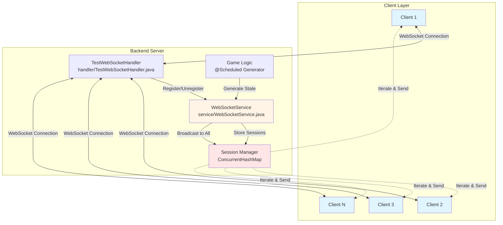
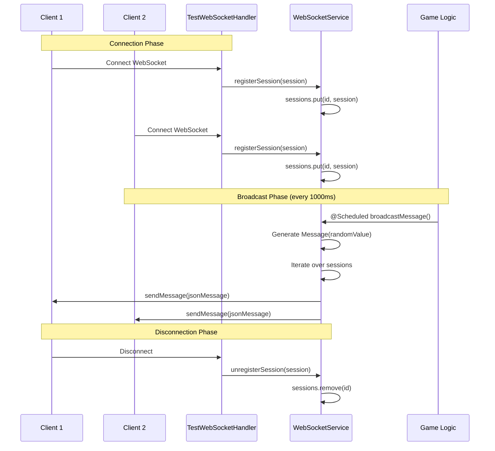
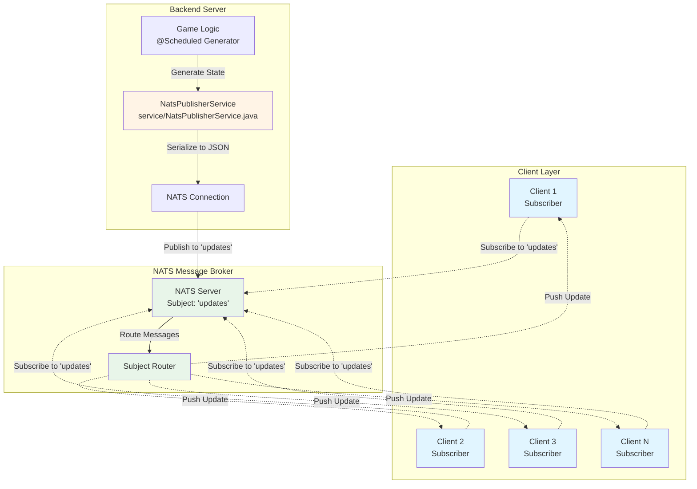
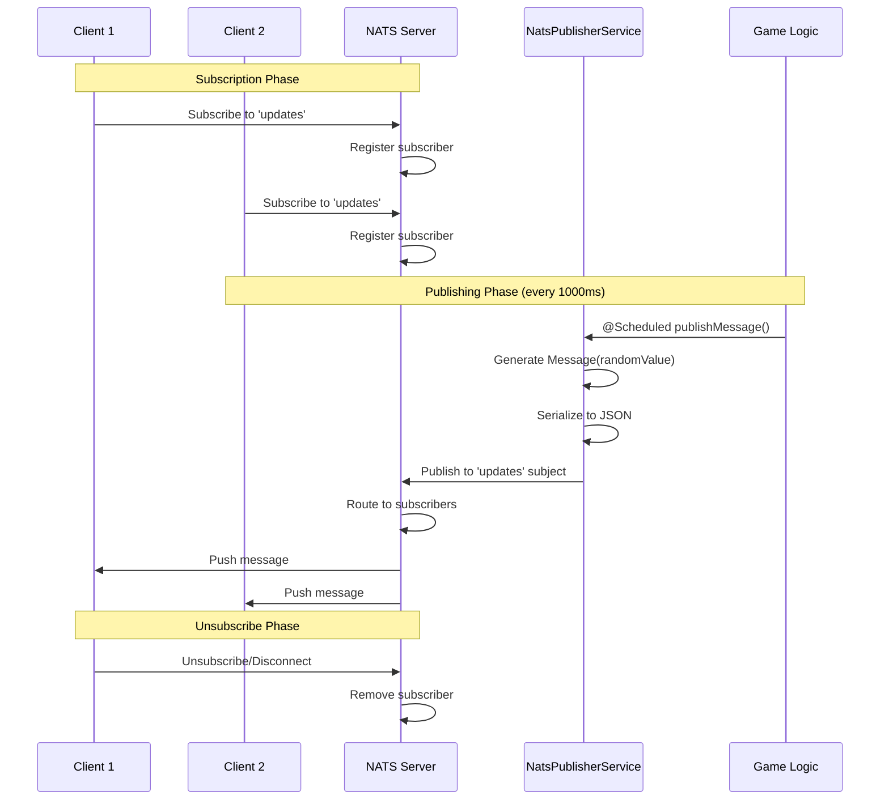
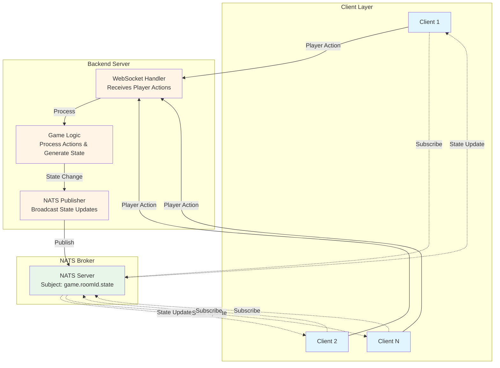
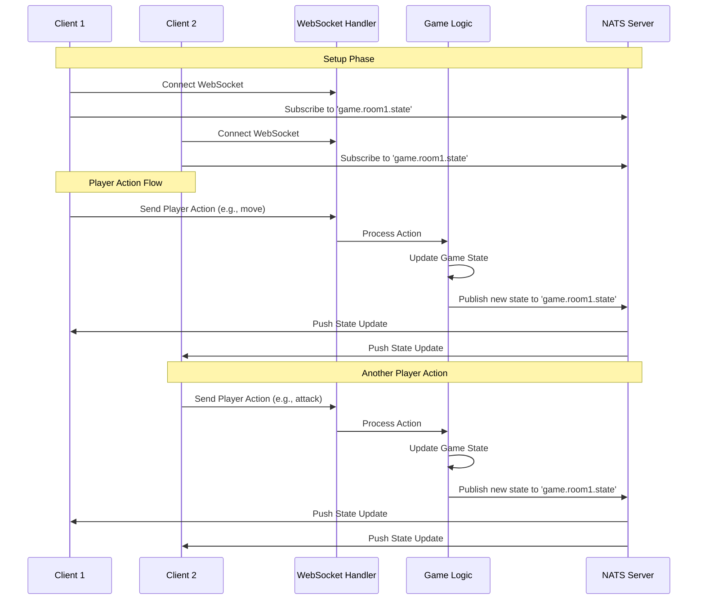

# 🎮 Real-time Game State Management

> **Comparing WebSocket vs NATS for multiplayer game development**

---

## 📊 Architecture Comparison

A comprehensive analysis of two real-time communication approaches for a **4-8 player game** with frequent state changes.

---

## 🔌 WebSocket Approach

**Implementation:** [`WebSocketService.java`](backend/src/main/java/de/ostfalia/backend/service/WebSocketService.java)

### Architecture Diagram



### Message Flow



### ✅ Advantages

- **Simple Architecture** - Direct persistent connection between client and server
- **Low Latency** - No intermediary message broker
- **Native Support** - Built-in Spring Boot WebSocket support
- **Easy Implementation** - Straightforward to set up and configure
- **Direct Client Management** - Backend tracks sessions directly (WebSocketService.java:20)
- **Lightweight** - No additional infrastructure needed for small-scale deployments

### ❌ Disadvantages

- **Tight Coupling** - Backend handles all broadcast logic directly
- **Limited Scalability** - Difficult to scale horizontally (sessions tied to specific server instance)
- **No Persistence** - Messages lost if client disconnects
- **Manual Session Management** - Requires managing ConcurrentHashMap of sessions manually
- **Single Point of Failure** - All connections drop if backend restarts

---

## 🚀 NATS Approach

**Implementation:** [`NatsPublisherService.java`](backend/src/main/java/de/ostfalia/backend/service/NatsPublisherService.java)

### Architecture Diagram



### Message Flow



### ✅ Advantages

- **Pub/Sub Model** - Clean separation between publishers and subscribers
- **Horizontal Scalability** - Multiple backend instances can publish; NATS handles routing
- **Message Buffering** - Efficiently handles bursts of messages
- **Decoupled Architecture** - Backend doesn't manage individual client connections
- **Subject-Based Routing** - Easy implementation of room/game-specific channels
- **Quality of Service** - Better guarantees for message delivery
- **Future-Proof** - Easy to add features like game replays, spectators, or multiple game rooms

### ❌ Disadvantages

- **Additional Infrastructure** - Requires NATS server (though already set up in this project)
- **Increased Complexity** - Extra layer of abstraction
- **Minimal Overhead** - Small additional latency from message broker (typically <1ms)

---

## 🏆 Recommendation: **NATS**

### Why NATS is Better for This Use Case

#### 1. **Game Rooms & Lobbies**

With NATS subjects like `game.room1.state` and `game.room2.state`, you can easily support multiple concurrent games. WebSocket would require complex routing logic.

#### 2. **State Synchronization**

NATS pub/sub ensures all clients get the same state updates reliably, even when scaling to multiple backend instances.

#### 3. **Scalability**

Even though 4-8 players is small-scale, NATS makes it trivial to support multiple game instances or grow later.

#### 4. **Performance**

NATS is extremely fast (millions of messages/sec) with negligible latency. For game state updates every 16-33ms (30-60 FPS), this is perfect.

#### 5. **Decoupling**

Game logic can publish state changes without worrying about which clients are connected—NATS handles delivery.

#### 6. **Feature Extensibility**

Easy to add spectator mode, game replay, or server-side game state validation later.

---

## 🎯 Recommended Implementation Pattern

### **Hybrid Approach: WebSocket + NATS**

Combine both technologies for optimal performance:



### Message Flow



### Benefits of Hybrid Approach

- **WebSocket** for client-to-server commands (low latency, simple request/response)
- **NATS** for server-to-client state broadcasts (reliable, scalable, decoupled)
- **Bidirectional Communication** - WebSocket for actions, NATS for state synchronization
- **Scalability** - Multiple backend instances can handle actions and publish to NATS
- **Best of Both Worlds** - Simplicity of WebSocket + power of pub/sub messaging

---

## 📁 Project Structure

```
backend/src/main/java/de/ostfalia/backend/
├── domain/
│   └── Message.java                    # Message domain model
├── handler/
│   └── TestWebSocketHandler.java       # WebSocket handler
├── service/
│   ├── NatsPublisherService.java       # NATS publisher service
│   └── WebSocketService.java           # WebSocket service
```

---

## 🛠️ Technology Stack

- **Spring Boot** - Backend framework
- **NATS** - Message broker for pub/sub
- **WebSocket** - Real-time bidirectional communication
- **Java** - Primary programming language

---

## 🐳 Docker/Podman

Build and run all services (frontend, backend, NATS):

### Docker

```bash
docker-compose up --build

```

### Podman

```bash
podman-compose up --build
```

Access at:

- Frontend: http://localhost:3000
- Backend: http://localhost:42069
- NATS: nats://localhost:4222

---

## 📝 License

This is a technical evaluation and implementation guide for real-time multiplayer game architecture.
